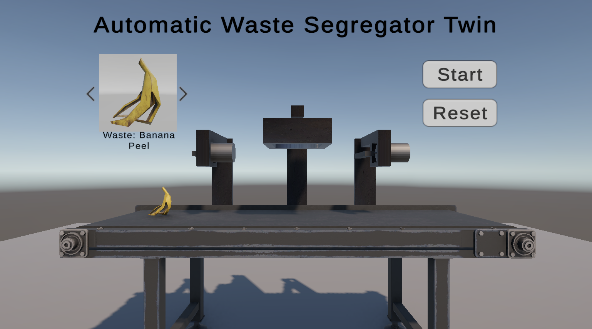

# ♻️ Automatic Waste Segregator Twin – Digital Twin Simulation Prototype

**Automatic Waste Segregator Twin** is a Unity-based simulation of an automatic waste sorting machine, featuring virtual sensors, actuators, and UI controls. I originally built this as part of my Bachelor's thesis along with three teammates. 
This project serves as a digital twin prototype of that system, simulating real-world waste segregation into Metal, Dry, and Wet categories.

> 🧪 *This is a digital twin prototype, not yet synchronized with a real machine. Intended for portfolio demonstration and future extensibility.*

---

## 🚀 Features

- ♻️ **Waste Type Selection with Preview**  
  Use `Next` / `Prev` buttons to cycle through waste types with live preview and name display.

- 🖥️ **Conveyor Belt Simulation**  
  Realistic belt movement with configurable speed and direction.

- 🪙 **Metal Detection Logic**  
  At Position 1, detects metal waste and ejects via the first flapper.

- 🌧️ **Dry/Wet Detection Logic**  
  At Position 2, differentiates dry and wet waste using a humidity sensor.

- 📦 **Dry Waste Ejection**  
  Dry waste is ejected at Position 3 by the second flapper.

- 🚯 **Wet Waste to End Bin**  
  Wet waste continues to the end of the belt and falls into the end bin.

- 🔄 **Reset Mechanism**  
  Resets waste position, UI, and belt state — ready for the next run.

---

## 🖼️ Simulation Preview

---

## 🛠️ Tech Stack

- **Unity** (2022.3 LTS or later)
- **C#**
- **TextMeshPro UI**
- Animator-driven flapper & box
- Rigidbody & Collider-based physics
- Digital Twin architecture principles

---

## 🧩 Upcoming Features

- 📊 **Add Sensor and Actuator Models**  
  Enable interaction with sensor components to display metadata and simulate hardware feedback.
